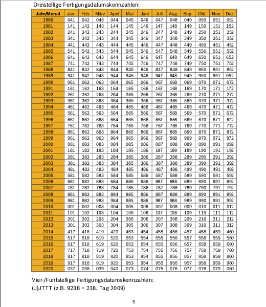

## hometop short intro

**Table of Content**

- [Preconditions to check](#preconditions) 
- [Check factory build date](#factorycheck) 
- [Enable/Disable Interfaces](#enabledisableIF) 
- [MQTT Interface](#mqttIF) 
- [SPS Interface](#spsIF) 

## Preconditions  
 
First check the heatersystem hardware for the heater-controller type and it's factory-build date.  
 
<table>
<tr>
    <th>Brand</th>
    <th>Controller-type</th>
    <th>Heater bus-type</th>
    <th>Action</th>
</tr>
<tr>
    <td>Junkers</td>
    <td>Fxyz e.g.: 
        FR100, FW100, 
        FW110, FW120, 
        FB10, FB100, 
        FW200
    </td>
    <td>Heatronic 3i/4i</td>
    <td>check factory build date 
    </td>
</tr>
<tr>
    <td>Bosch/Junkers</td>
    <td>Cxyz e.g.: 
        CW100, CW200, 
        CR10
    </td>
    <td>EMS 2</td>
    <td>nothing to do</td>
</tr>
</table>

### Factory build date check  

For the Fxyz controller-types a factory build date check is required.  
 
- open the cover on the Fxyz controller and read the FD-code (Fertigungsdatum) at the inner side.  
- Find the build-month and year in the table below.  
- compare the date with requirements.  

Requirement:  
At least the FD-Code:FD991 (November of 2009) and later is required for controlling the heater-system with commands.

FD-Code table:  

## Enable/Disable Interfaces  
 
During installation with script:'ht_project_setup.sh' the requested configuration is written to the configuration-files.  

Per default following interfaces are enabled/disabled:  
 
<table>
<tr>
    <th>Interface</th>
    <th>Status</th>
    <th>Configuration-file</th>
    <th>Remark</th>
</tr>
<tr>
    <td>sqlite</td>
    <td>Disabled</td>
    <td>./sw/etc/config/HT3_db_cfg.xml</td>
    <td>`<sql-db><enable>off</enable></sql-db>`</td>
</tr>
<tr>
    <td>rrdtool</td>
    <td>Enabled</td>
    <td>./sw/etc/config/HT3_db_cfg.xml</td>
    <td>`<rrdtool-db><enable>on</enable></rrdtool-db>`</td>
</tr>
<tr>
    <td>MQTT-If</td>
    <td>Disabled</td>
    <td>./sw/etc/config/collgate_cfg.xml</td>
    <td>`<MQTT_client_if><enable>Off</enable></MQTT_client_if>`</td>
</tr>
<tr>
    <td>SPS-If</td>
    <td>Disabled</td>
    <td>./sw/etc/config/collgate_cfg.xml</td>
    <td>`<SPS_if><enable>Off</enable></SPS_if>`</td>
</tr>
</table>
  
It's possible to reconfigure the enabled/disabled interfaces manualy in that configuration-files.  
The flags 'On'/'Off' are not case sensitive.  
After reconfiguration a restart of 'ht_collgate.py' or a reboot is required.  

## MQTT Interface  
 
With enabled MQTT interface received and decoded heater-bus data are send to the MQTT-broker (publish)  
and received data from the MQTT-broker (subscripe) are executed as commands.  

Only updated heaterbus data are send to the MQTT-broker to minimize the traffic load.  
It's possible to change this handling in the configuration-file: ./sw/etc/config/mqtt_client_cfg.xml setting the flag to 'False'  
 `<Publish_OnlyNewValues>False</Publish_OnlyNewValues>`  

The published MQTT-data have the following form:  
  `topic-rootname/accessname`  
e.g.:  
    `hometop/ht/hc1_Tmeasured`
    
The topic-rootname is configureable in file: ./sw/etc/config/mqtt_client_cfg.xml   
 `<topic_root_name>hometop/ht</topic_root_name>`

Setup of heaterbus-data is possible also with MQTT-commands in following form:  
  `set/topic-rootname/accessname`  
e.g.:  
    `set/hometop/ht/hc1_Tdesired`

Interface-data:  

- hostname: 'localhost'
- port: '1883' 
 
Following table shows the possible MQTT-commands sendable to the heater-bus:  
 
<table>
<tr>
    <th>Set command 
        (X in range 1...4)
    </th>
    <th>Parameter</th>
    <th>Controller -Type</th>
    <th>MQTT topic e.g.</th>
    <th>Remark 
        (X in range 1...4)
    </th>
</tr>
<tr>
    <td>hcX_Tdesired</td>
    <td>Temp-value,heizen 
        Temp-value,sparen 
        Temp-value,frost
    </td>
    <td>Fxyz</td>
    <td>set/hometop/ht/hc1_Tdesired -m "21.0,heizen" 
        set/hometop/ht/hc2_Tdesired -m "20.5,sparen" 
        set/hometop/ht/hc3_Tdesired -m "15.0,frost"
    </td>
    <td>setup Tdesired, niveau:'mode' for heating-circuit number:X</td>
</tr>
<tr>
    <td>hcX_Tniveau</td>
    <td>heizen 
        sparen 
        frost 
        auto
    </td>
    <td>Fxyz</td>
    <td>set/hometop/ht/hc1_Tniveau -m "heizen" 
        set/hometop/ht/hc2_Tniveau -m "sparen" 
        set/hometop/ht/hc3_Tniveau -m "frost" 
        set/hometop/ht/hc4_Tniveau -m "auto"
    </td>
    <td>setup Tniveau to 'mode' for heating-circuit number:X</td>
</tr>
<tr>
    <td>hcX_Tdesired</td>
    <td>Temp-value,temporary 
        Temp-value,comfort1 
        Temp-value,comfort2 
        Temp-value,comfort3 
        Temp-value,eco 
        Temp-value,manual
    </td>
    <td>Cxyz</td>
    <td>set/hometop/ht/hc1_Tdesired -m "21.0,temporary" 
        set/hometop/ht/hc2_Tdesired -m "20.0,comfort1" 
        set/hometop/ht/hc3_Tdesired -m "22.5,comfort2" 
        set/hometop/ht/hc4_Tdesired -m "21.5,comfort3" 
        set/hometop/ht/hc1_Tdesired -m "20.5,eco" 
        set/hometop/ht/hc2_Tdesired -m "22.5,manual"
    </td>
    <td>setup Tdesired, niveau:'mode' for heating-circuit number:X</td>
</tr>
<tr>
    <td>hcX_Tniveau</td>
    <td>manual 
        auto
    </td>
    <td>Cxyz</td>
    <td>set/hometop/ht/hc1_Tniveau -m "manual" 
        set/hometop/ht/hc4_Tniveau -m "auto"
    </td>
    <td>setup Tniveau to 'mode' for heating-circuit number:X</td>
</tr>
<tr>
    <td>dhw_charge_once</td>
    <td>On 
        Off
    </td>
    <td>Cxyz 
        Fxyz
    </td>
    <td>set/hometop/ht/dhw_charge_once -m "Off" 
        set/hometop/ht/dhw_charge_once -m "On"
    </td>
    <td>setup Domestic Hot Water charge-once to 'On/Off'</td>
</tr>
<tr>
    <td>dhw_Tsetpoint_max</td>
    <td>Temp-value</td>
    <td>Cxyz 
        Fxyz (TBD)
    </td>
    <td>set/hometop/ht/dhw_Tsetpoint_max -m "61"</td>
    <td>setup Domestic Hot Water setpoint Max to 'Temp-value'</td>
</tr>
<tr>
    <td>dhw_Tsetpoint_min</td>
    <td>Temp-value</td>
    <td>Cxyz</td>
    <td>set/hometop/ht/dhw_Tsetpoint_min -m "45"</td>
    <td>setup Domestic Hot Water setpoint Min to 'Temp-value'</td>
</tr>
<tr>
    <td>dhw_mode</td>
    <td>Off 
        Low 
        High 
        HC 
        WW
    </td>
    <td>Cxyz</td>
    <td>set/hometop/ht/dhw_mode -m "WW"</td>
    <td>setup Domestic Hot Water Mode to 'mode' 
        mode-values are: 
            Off = dhw generation off 
            Low = dhw generation constantly reduced 
            High = dhw generation constantly high 
            HC = heaterprogramm controlled 
            WW = waterprogramm controlled
    </td>
</tr>
<tr>
    <td>dhw_disinfect_mode</td>
    <td>manual 
        auto
    </td>
    <td>Cxyz 
        Fxyz
    </td>
    <td>set/hometop/ht/dhw_disinfect_mode -m "auto" 
        set/hometop/ht/dhw_disinfect_mode -m "manual"
    </td>
    <td>setup Domestic Hot Water disinfect to 'auto/manual'</td>
</tr>
<tr>
    <td>dhw_Tsetpoint_normal</td>
    <td>Temp-value</td>
    <td>Cxyz 
        Fxyz
    </td>
    <td>set/hometop/ht/dhw_Tsetpoint_normal -m "49"</td>
    <td>setup Domestic Hot Water setpoint normal to 'Temp-value'</td>
</tr>
</table>

## SPS Interface  
 
With enabled SPS interface received and decoded heater-bus data can be requested with commands.  

Interface-data:  

- hostname: 'localhost'
- port: '10001' 
 
That example-modul: './sw/test/sps_testclient.py' is able to send requests to the enabled SPS-interface.  
Responses are displayed on the terminal.  
It's possible to send 'sps_cmd' or 'accessname' to the interface to get current available heater-data.  

See csv-file for more details:  

[sps commands](./sps_accessname_cmdmap.csv)
